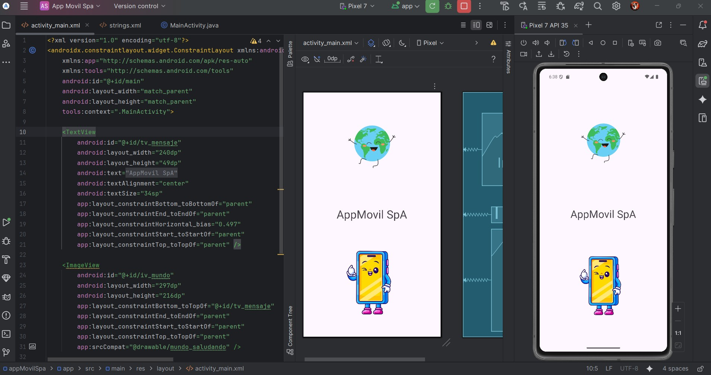

**_<h1 align="center">:vulcan_salute: Proyecto Realizado con Andoid Studio - App Movil SpA:</h1>_**

**<h3>:blue_book: Contexto del Proyecto:</h3>**

<p>La empresa de tecnología "AppMovil SpA" se encuentra en plena expansión y necesita que sus nuevos desarrolladores conozcan a fondo el entorno de desarrollo para Android.</p>
<p>Como parte del proceso de inducción, te han asignado la tarea de instalar, configurar y realizar la primera ejecución de un proyecto en Android Studio, dejando todo listo para comenzar a desarrollar interfaces de usuario en las próximas etapas.</p>

**<h3>:orange_book: Requerimiento:</h3>**

<p>Queremos que configures correctamente Android Studio, prepares el entorno de ejecución y nos demuestres el flujo completo hasta generar un APK de depuración de un proyecto básico usando uno de los templates de Android Studio. Además, debes documentar el proceso destacando los principales elementos del entorno y sus funciones.</p>
<p>Deberás realizar la instalación y configuración inicial de Android Studio, asegurando la correcta integración de los siguientes componentes:</p>
<ul>
    <li>SDK de Android</li>
    <li>Emulador o dispositivo físico para pruebas</li>
    <li>Gradle y sus herramientas de compilación</li>
    <li>Herramientas de desarrollo específicas para el template seleccionado</li>
</ul>
<p>Una vez configurado el entorno, deberás:</p>

1. Crear un nuevo proyecto en Android Studio, utilizando uno de los templates predeterminados (por ejemplo, Empty Activity).
2. Compilar y ejecutar correctamente la aplicación en un emulador o dispositivo físico.
3. Generar un APK de depuración (debug.apk) a partir del proyecto
creado.
4. Documentar detalladamente cada paso del proceso, incluyendo:
    - Configuración del entorno (SDK Manager, AVD Manager, configuración de Gradle)
    - Descripción del template utilizado y su estructura base de archivos
    - Flujo de compilación y generación del APK
    - Función de los componentes clave del entorno de desarrollo (IDE, emulador, Gradle, Logcat, entre otros)

**<h3>📁 Estructura del Proyecto Android:</h3>**

```Android
📘 README.md
📁 app
├── 📁 manifest
│   └── 🟧 AndroidManifest.xml
├── 📁 java
│   ├── 📁 cl.bootcamp.holamundo
│   │   └── 🟦 MainActivity.java
│   ├── 📁 cl.bootcamp.holamundo (android Test)
│   │   └── 🟦 ExampleInstrumentedTest.java
│   └── 📁 cl.bootcamp.holamundo (test)
│       └── 🟦 ExampleUnitTest.java
├── 📁 java (generated)
├── 📁 res
│   ├── 📁 drawable
│   │   │    ├── 🖼️ app_movil_spa.jpg
│   │   │    ├── 🖼️ mundo_saludando.png
│   │   │    ├── 🖼️ telefono_saludando.png
│   │   │    ├── 🟧 ic_launcher_background.xml
│   │   │    └── 🟧 ic_launcher_foreground.xml
│   ├── 📁 layout
│   │   └── 📁 activity_main.xml
│   ├── 📁 layout-land
│   │   └── 📁 activity_main.xml
│   ├── 📁 mipmap
│   │   ├── 📁 ic_launcher
│   │   └── 📁 ic_launcher_round
│   ├── 📁 values
│   │   ├── 📁themes
│   │   │   ├── 🟧 themes.xml
│   │   │   └── 🟧 themes.xml (night)
│   │   ├── 🟧 colors.xml
│   │   └── 🟧 strings.xml
│   └── 📁 xml
📁 Gradle Scripts
├── 🟦 build.gradle.kts (Project: HolaMundo)
├── 🟦 build.gradle.kts (Module: app)
├── 🟦 proguard-rules.pro (ProGuard rules for ":app")
├── 🟦 gradle.properties (Project properties)
├── 🟦 gradle-wrapper.properties (Gradle Version)
├── 🟦 libs.versions.toml (version Catalog "libs")
├── 🟦 local.properties (SDK Location)
└── 🟦 settings.gradle.kts (Project Settings)
```

**<h3>:book: Imagen general del proyecto:</h3>**


